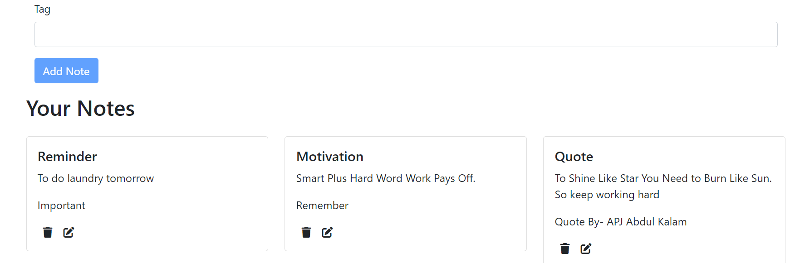

# Full Stack MERN Notes Application

## Overview
This application is a full stack MERN (MongoDB, Express.js, React, Node.js) solution designed to manage personal notes. It includes user authentication with JWT and CRUD operations for note management.

## Features
- **User Authentication**: Used JWT and OAuth for authentication and authorization for secure login and signup pages.
- **CRUD Operations**: Users can create, read, update, and delete their personal notes.

## Technologies Used
- **Frontend**: Utilized HTML,CSS and Javascript along with react to build responsive and interactive user interfaces.Followed MVC architecture for clean code and future expansion possibilities.
- **Backend**: Built and maintained RESTful APIs using Node.js and Express.
- **Database**: Maintained database intercation with MongoDB ensuring efficient data retrival and storage.
- **API Testing**: Postman

## Different Pgaes
- **Login Page**:

- **SignUp Page**:

- **Notes Page**:

## Architecture
- **MVC Architecture**: The application follows the Model-View-Controller pattern, ensuring a separation of concerns and a more organized codebase.

## Getting Started
To run the application, execute the following commands in both the backend and frontend directories:
-npm install 
-npm start

## File Structure
- **backend**
  - **models**: Schemas for User and Notes.
  - **middlewares**: Authentication middleware.
  - **routes**: Auth and Notes routes.
- **public**: Contains the built static files for the frontend.
- **src**
  - **components**: React components for the application's UI.
  - **context**: State management using React context.
  - **App.css**: Styling for the app.
  - **App.js**: Main React component.
  - **index.css**: Global styles.
  - **index.js**: Entry point for the React app.

## Installation
1. Clone the repository.
2. Navigate to the backend directory and run `npm install`.
3. Start the backend server with `npm start`.
4. Repeat steps 2 and 3 for the frontend directory.

## Usage
After starting the servers, open your web browser and go to `http://localhost:3000` to view the application.

